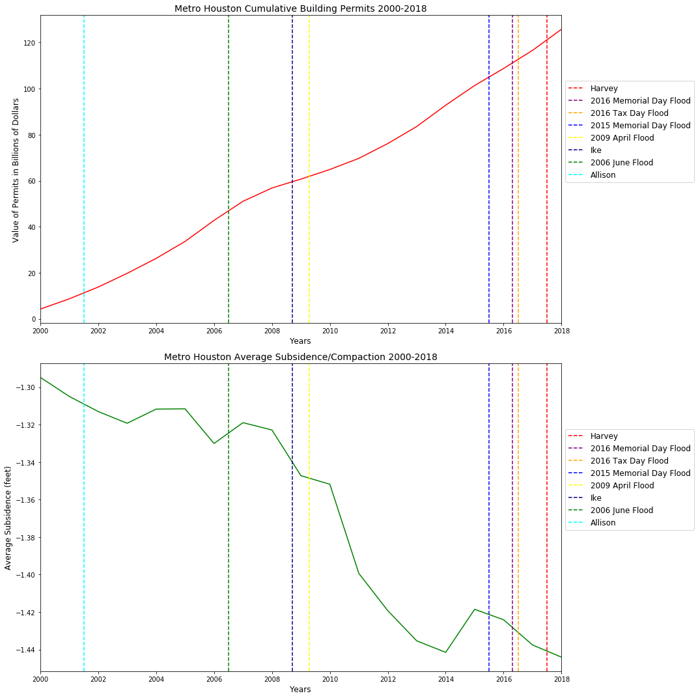
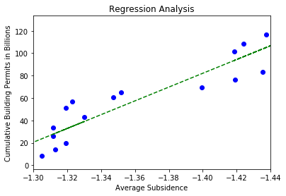
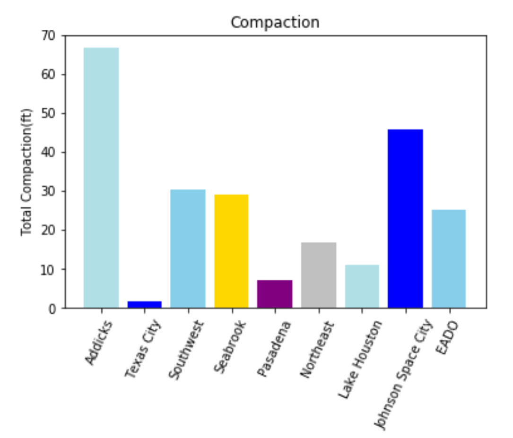
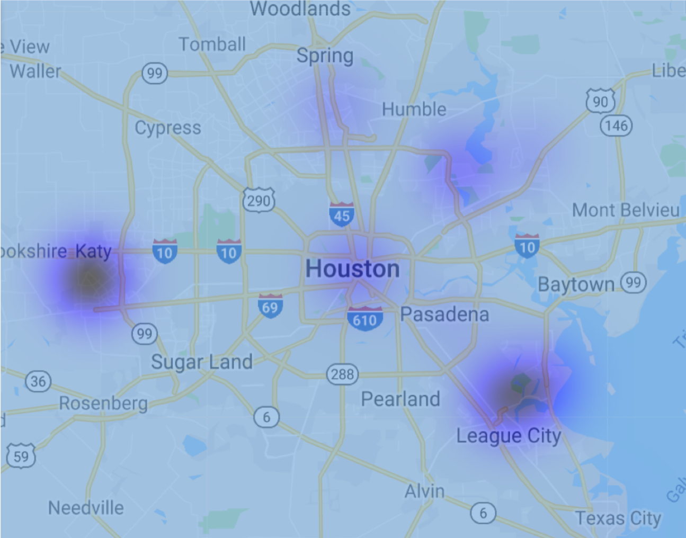
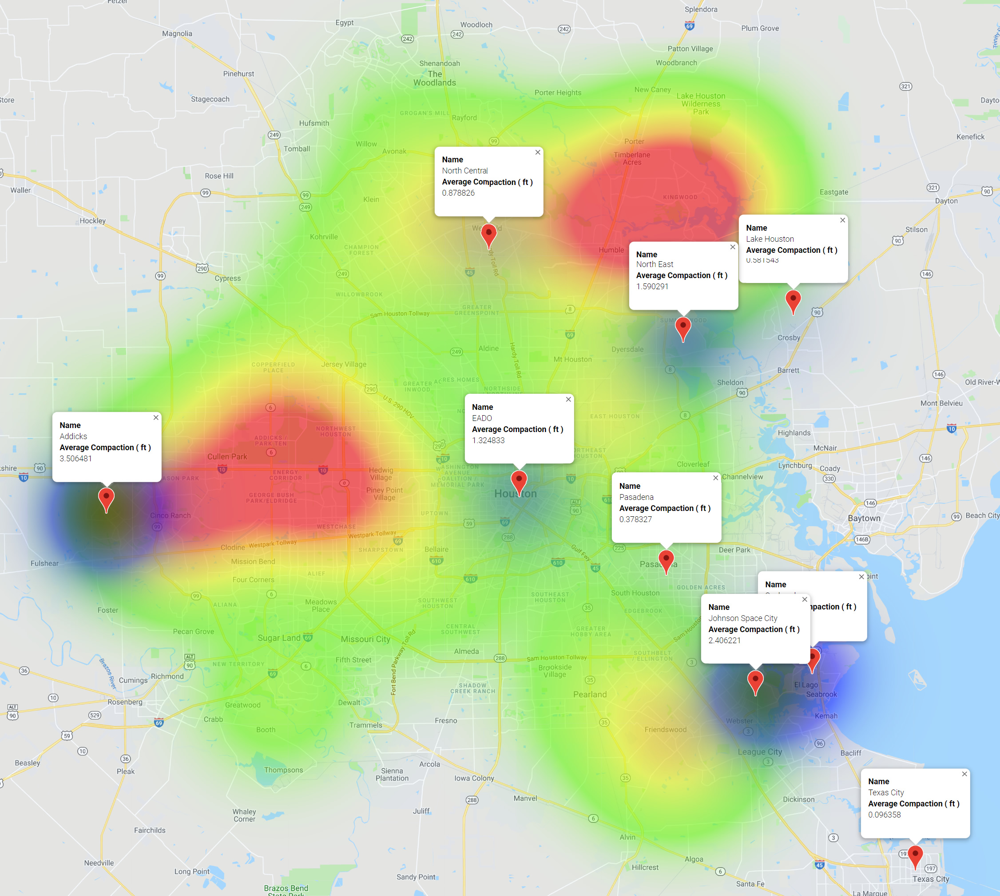

## Project #1  | Concrete Deluge | How does uncontrolled urban sprawl impact flooding???

The city of Houston and nearby counties have experienced an exponential amount of residential and commercial growth. Below

- - -
This project attempts to demonstrate the correlation between urban construction and water retention during natural disasters. We utilized building permits to demonstrate city growth and FEMA/USGS data for flooding and subsidence. Plotted graphics and created heatmaps to help visualize the impact over the years.

## Project Development:

* Used Pandas to import, clean and format dataset(s).
* Created a Jupyter Notebook describing the data exploration and cleanup process and illustrating the final data analysis.
* Used Matplotlib to create a total of 8 visualizations of the data

# Conclusions:
The first plot below demonstrates the growth of the given building permits since 2000. The second plot shows the amount of soil compaction during the same period.

After performing a regression analysis of the cumulative building permits and subsidence, it appears that there is a linear relationship between the increase of building permits and soil compaction/subsidence.

Sediment compaction varies throughout the city of Houston as a result of construction distribution providing mechanical forces, groundwater level decrease, and elevation. 

Since 2000 the compaction has been measured with the utilization of water wells. 

The amount of sediment compaction can be seen in varying degrees in the Houston area.  The darker areas show the areas with the most compaction.

Comparison of areas with a count of FEMA claims for Harvey repair over $25K and areas of compaction.  The darker blue areas show greater compaction.  The red areas show greater number of Harvey claims.

© 2019 Rice Cookers | Stacey Hood, Maria Squier & Brian Labelle | Sous-Coding Chefs

- - -
