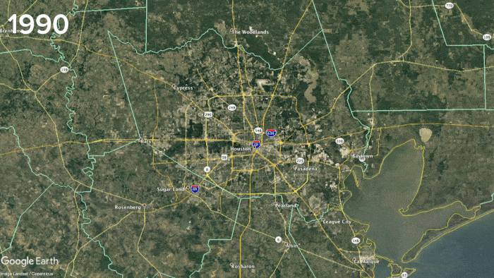

## Project #1  | How does uncontrolled urban sprawl impact flooding ???

- - -

# Project Requirements:
## Development Requirements:

* Use Pandas to clean and format your dataset(s).
* Create a Jupyter Notebook describing the data exploration and cleanup process.
* Create a Jupyter Notebook illustrating the final data analysis.
* Use Matplotlib to create a total of 6–8 visualizations of your data (ideally, at least 2 per ”question” you ask of your data).
* Save PNG images of your visualizations to distribute to the class and instructional team, and for inclusion in your presentation.
* (Optional) Use at least one API, if you can find an API with data pertinent to your primary research questions.
* Create a write-up summarizing your major findings. This should include a heading for each “question” you asked of your data and a short description of your findings and any relevant plots.

## Presentation Requirements:
You will also be responsible for preparing a formal, 10-minute presentation that covers:

* Questions you found interesting and what motivated you to answer them
* Where and how you found the data you used to answer these questions
* The data exploration and cleanup process (accompanied by your Jupyter Notebook)
* The analysis process (accompanied by your Jupyter Notebook)
* Your conclusions, which should include a numerical summary and visualizations of that summary
* The implications of your findings: what do your findings mean?

## Suggested Data Sources:

Feel free to ask us (the instructional staff) for input, but our general advice is to
* stick to data sources that:
* Are sufficiently large.
* Have a consistent format.
* Ideally, contain more data than needed.
* Are well-documented.

## Submit Project Proposal for Approval:
Lorem ipsum dolor sit amet, duis nulla ad, integer eu. Augue mi, dictum rhoncus turpis, in mi amet. Vitae quam enim. Pede consequat. Lobortis sollicitudin enim, eu etiam et. Vehicula mi, etiam condimentum tellus, nibh dictum cras.

# Referenced Links:

- - -

© 2019 Rice Cookers | Stacey Hood, Maria Squier & Brian Labelle | Sous-Coding Chefs

- - -
